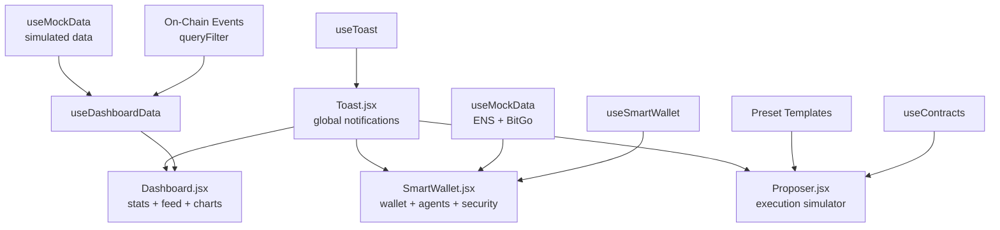

# Design Document: TrustNet-Inspired UI/UX for DarkAgent

## Overview

This design transforms DarkAgent's existing basic frontend into an enterprise-grade analytics and control interface inspired by TrustNet's multi-tenant SaaS patterns. The existing Vite + React 19 + Wagmi v2 + Tailwind CSS v4 stack is preserved; no migration to Next.js. The design system already defined in `index.css` (glass cards, stat cards, badges, progress bars, code windows, animations) is the foundation — Dashboard.jsx and Proposer.jsx are rebuilt from scratch to use it, and new components are added on top.

The core UX narrative for hackathon judges: DarkAgent is the trust layer between AI agents and DeFi wallets. Every screen should reinforce this — verification flows are visualized, spending limits are prominent, and the ENS → DarkAgent → SmartWallet → Base pipeline is always visible.

### Key Design Decisions

- **No new backend**: All data comes from on-chain event queries (ethers.js `queryFilter`) and mock/simulated data for demo purposes. The existing `useContracts` and `useSmartWallet` hooks are the data layer.
- **Recharts for charts**: Lightweight, tree-shakeable, React-native. Used only for sparklines and the 7-day volume line chart. No heavy chart libraries.
- **Radix UI primitives**: Added for Dialog (confirmation modals), Tooltip (step explanations), and Tabs (SmartWallet tabs). Styled with existing CSS variables.
- **Toast system**: Custom lightweight implementation using React state + CSS animations. No external toast library needed.
- **Mock data layer**: A `useMockData` hook provides simulated agent activity, ENS records, and BitGo policy data for demo when on-chain data is sparse.

---

## Architecture

```
src/
├── components/
│   ├── Toast.jsx              # Toast notification system
│   ├── VerificationStep.jsx   # Single step in verification flow
│   ├── VerificationFlow.jsx   # Full ENS→DarkAgent→SmartWallet→Base pipeline
│   ├── ActivityFeedItem.jsx   # Single item in real-time activity feed
│   ├── ActivityFeed.jsx       # Scrollable feed with 100-item cap
│   ├── IntegrationCard.jsx    # Status card for Coinbase/ENS/BitGo
│   ├── Sparkline.jsx          # Pure CSS or recharts mini chart
│   ├── AgentCard.jsx          # Agent list item with allowance progress
│   └── ENSPermissionPanel.jsx # ENS records display
├── hooks/
│   ├── useContracts.js        # existing — on-chain reads via ethers
│   ├── useSmartWallet.js      # existing — Coinbase Smart Wallet
│   ├── useDashboardData.js    # new — aggregates events into dashboard stats
│   ├── useToast.js            # new — toast state management
│   └── useMockData.js         # new — simulated data for demo
├── pages/
│   ├── SmartWallet.jsx        # existing — add AgentManagement tab
│   ├── Dashboard.jsx          # REBUILD — analytics dashboard
│   └── Proposer.jsx           # REBUILD — execution simulator
└── index.css                  # existing design system (unchanged)
```

### Data Flow



### State Management

No global state library (Redux/Zustand) is needed. State is co-located:
- Dashboard stats: `useDashboardData` hook (local state + contract events)
- Toast queue: `useToast` hook (React context, provided at App level)
- Theme preference: `localStorage` + CSS class on `<html>`
- Verification flow animation: local state in `VerificationFlow` component

---

## Components and Interfaces

### Toast System

```jsx
// useToast.js — context + hook
const ToastContext = createContext()
export function ToastProvider({ children }) { ... }
export function useToast() { return useContext(ToastContext) }

// API
const { toast } = useToast()
toast.success("Agent authorized successfully!")
toast.error("Transaction failed: insufficient balance")
toast.pending("Verifying permissions...")
toast.dismiss(id)
```

Toast renders as a fixed stack in the bottom-right corner. Each toast has a type (success/error/pending/info), message, optional tx hash link, and auto-dismisses after 5s. Max 5 toasts visible at once.

### VerificationFlow Component

```jsx
// Props
{
  steps: [
    { id: 'ens', label: 'ENS Lookup', icon: '🌐', status: 'complete'|'active'|'pending'|'error', timeMs: 45, error?: string },
    { id: 'darkagent', label: 'DarkAgent Verify', icon: '⚡', status, timeMs },
    { id: 'smartwallet', label: 'Smart Wallet', icon: '🔵', status, timeMs },
    { id: 'base', label: 'Base Execution', icon: '🔷', status, timeMs },
  ],
  animated: boolean  // whether to animate step-by-step
}
```

Renders as a horizontal pipeline on desktop, vertical on mobile. Active step has a pulsing magenta glow. Completed steps show a green checkmark. Failed steps show red with error tooltip. Step transitions animate at 300ms.

### ActivityFeedItem Component

```jsx
// Props
{
  type: 'proposal'|'verification'|'execution'|'freeze',
  agentAddress: string,
  proposalId: string,
  status: 'proposed'|'verified'|'rejected'|'executed',
  timestamp: number,  // unix
  txHash?: string
}
```

Renders as a single row with type icon, truncated agent address (monospace), status badge, relative timestamp ("2m ago"), and optional block explorer link.

### IntegrationCard Component

```jsx
// Props
{
  name: 'Coinbase Smart Wallet'|'ENS'|'BitGo'|'Base',
  logo: string,  // emoji or SVG path
  status: 'connected'|'disconnected'|'pending',
  metric: { label: string, value: string },
  description: string,
  learnMoreUrl?: string
}
```

Renders as a glass card with colored status dot, metric display, and optional "Learn More" link.

### AgentCard Component

```jsx
// Props
{
  address: string,
  status: 'active'|'frozen'|'expired',
  spendLimit: bigint,
  dailyLimit: bigint,
  dailySpent: bigint,
  expiresAt: number,
  capabilities: string[],
  ensRecords?: { maxSpend: string, slippage: string, protocols: string[] }
}
```

Renders with address (monospace, truncated), status badge, daily allowance progress bar, capability tags, and optional ENS records section.

### Sparkline Component

```jsx
// Props
{
  data: number[],   // array of values (last 7 days)
  color?: string,   // CSS color, defaults to brand-magenta
  height?: number   // px, defaults to 40
}
```

Uses `recharts` `LineChart` with no axes, no grid, no tooltip — pure sparkline. Falls back to a CSS gradient bar if recharts is not available.

---

## Data Models

### DashboardStats

```typescript
interface DashboardStats {
  totalTransactions: number
  transactionsDelta: number        // % change vs previous period
  activeAgents: number
  avgVerificationTimeMs: number
  successRate: number              // 0-100
  errorCount: number
  dailyVolume: DailyVolumeBucket[] // last 7 days
}

interface DailyVolumeBucket {
  date: string    // "2024-01-15"
  count: number
  value: string   // ETH formatted
}
```

### ActivityItem

```typescript
interface ActivityItem {
  id: string
  type: 'proposal' | 'verification' | 'execution' | 'freeze'
  agentAddress: string
  userAddress: string
  proposalId: string
  status: 'proposed' | 'verified' | 'rejected' | 'executed'
  blockNumber: number
  timestamp: number
  txHash?: string
}
```

### VerificationStepState

```typescript
interface VerificationStepState {
  id: string
  label: string
  icon: string
  status: 'pending' | 'active' | 'complete' | 'error'
  timeMs?: number
  error?: string
  tooltip: string
}
```

### AgentRecord

```typescript
interface AgentRecord {
  address: string
  status: 'active' | 'frozen' | 'expired'
  spendLimit: bigint
  dailyLimit: bigint
  dailySpent: bigint
  expiresAt: number
  capabilities: string[]
  ensRecords?: ENSPermissionRecord
}

interface ENSPermissionRecord {
  maxSpend: string       // ETH value string
  slippage: string       // percentage string e.g. "0.5"
  protocols: string[]    // e.g. ["uniswap", "aave"]
  lastUpdated?: number   // unix timestamp
  isSet: boolean
}
```

### BitGoPolicyState

```typescript
interface BitGoPolicyState {
  walletAddress: string
  velocityLimit: string          // ETH
  addressWhitelist: string[]
  syncStatus: 'synced' | 'pending' | 'error'
  lastSyncAt: number
  privacyAddressCount: number
}
```

### ActionTemplate

```typescript
interface ActionTemplate {
  id: string
  name: string
  description: string
  icon: string
  targetAddress: string
  value: string
  calldata: string
  estimatedGas: string
}

// Presets
const TEMPLATES: ActionTemplate[] = [
  { id: 'transfer', name: 'Token Transfer', icon: '💸', ... },
  { id: 'swap', name: 'Uniswap Swap', icon: '🔄', ... },
  { id: 'deposit', name: 'Aave Deposit', icon: '🏦', ... },
]
```

### ToastItem

```typescript
interface ToastItem {
  id: string
  type: 'success' | 'error' | 'pending' | 'info'
  message: string
  txHash?: string
  duration?: number   // ms, default 5000
}
```

---

## Correctness Properties

*A property is a characteristic or behavior that should hold true across all valid executions of a system — essentially, a formal statement about what the system should do. Properties serve as the bridge between human-readable specifications and machine-verifiable correctness guarantees.*

### Property 1: Dashboard stats computation correctness

*For any* set of on-chain events (ActionProposed, ActionVerified, ActionExecuted), the computed `DashboardStats` must satisfy: `totalTransactions` equals the count of executed events, `successRate` equals `executedCount / proposedCount * 100`, and `errorCount` equals the count of rejected verifications.

**Validates: Requirements 3.1, 3.7**

### Property 2: Active agent count derivation

*For any* set of authorization and revocation events, the `activeAgents` count must equal the number of agents that have been authorized but not subsequently revoked and whose `expiresAt` timestamp is in the future.

**Validates: Requirements 3.2**

### Property 3: Average verification time computation

*For any* non-empty list of per-step verification times, the displayed average must equal `sum(times) / count(times)`, rounded to the nearest integer millisecond.

**Validates: Requirements 3.3**

### Property 4: Daily volume aggregation

*For any* set of timestamped execution events, grouping them into daily buckets must produce buckets where the sum of all bucket counts equals the total event count, and each event belongs to exactly one bucket.

**Validates: Requirements 3.4, 18.1, 18.4**

### Property 5: Activity feed ordering and size cap

*For any* set of activity items added to the feed, the feed must display items in descending timestamp order (most recent first), and the feed must never contain more than 100 items regardless of how many events are received.

**Validates: Requirements 3.5, 9.5, 9.8, 15.8**

### Property 6: Filter correctness

*For any* filter applied (by agent address, action type, or date range), every item in the filtered result must satisfy the filter predicate, and no item satisfying the predicate must be absent from the result.

**Validates: Requirements 3.6**

### Property 7: Agent authorization validation

*For any* authorization form submission where `perTransactionLimit > dailyLimit`, the system must reject the submission and not call the contract, leaving the agent list unchanged.

**Validates: Requirements 4.3**

### Property 8: Daily allowance progress calculation

*For any* agent with `dailyLimit > 0`, the progress bar fill percentage must equal `(dailySpent / dailyLimit) * 100`, clamped to the range [0, 100].

**Validates: Requirements 4.4**

### Property 9: ENS permission record completeness

*For any* agent that has ENS records set (`isSet === true`), the rendered agent card must include all three fields: `max_spend`, `slippage`, and `protocols`. No field may be absent or undefined in the rendered output.

**Validates: Requirements 4.8, 7.2, 7.3**

### Property 10: Verification step state rendering

*For any* `VerificationStepState`, the rendered step component must display the step's `timeMs` value when status is `complete` or `error`, and must display the `error` message when status is `error`.

**Validates: Requirements 6.3, 6.4**

### Property 11: Verification pipeline step ordering

*For any* verification flow, the steps must always render in the fixed order: ENS Lookup → DarkAgent Verify → Smart Wallet → Base Execution. No reordering is permitted regardless of step status.

**Validates: Requirements 6.1**

### Property 12: Execution simulator input validation

*For any* form submission in the Execution Simulator, if any required field (target address, calldata) is empty or the target address is not a valid EVM address, the submission must be blocked and an error message must be displayed.

**Validates: Requirements 10.3, 10.5**

### Property 13: Theme preference persistence

*For any* theme selection (dark/light) made by the user, the preference must be written to `localStorage` under the key `darkagent-theme`, and on the next page load the same theme must be applied before first render.

**Validates: Requirements 19.2**

### Property 14: Error message specificity

*For any* known contract error (insufficient balance, unauthorized agent, network error), the displayed error message must contain a human-readable description specific to that error type, not a raw revert string or generic "Error" message.

**Validates: Requirements 17.2**

### Property 15: RPC retry backoff

*For any* failed RPC call that is retried, each successive retry delay must be strictly greater than the previous delay (exponential backoff), and the system must not retry more than 3 times before surfacing the error to the user.

**Validates: Requirements 17.7**

---

## Error Handling

### Contract Interaction Errors

All contract calls are wrapped in try/catch. Errors are mapped to user-friendly messages via an error classifier:

```javascript
function classifyContractError(err) {
  if (err.code === 'INSUFFICIENT_FUNDS') return { message: 'Insufficient ETH balance. Add more ETH to your wallet.', action: 'fund' }
  if (err.message?.includes('unauthorized')) return { message: 'Agent is not authorized for this wallet.', action: 'authorize' }
  if (err.message?.includes('frozen')) return { message: 'Wallet is frozen. Unfreeze to allow agent activity.', action: 'unfreeze' }
  if (err.code === 'NETWORK_ERROR') return { message: 'Network error. Check your connection and try again.', action: 'retry' }
  return { message: err.reason || err.message || 'Unknown error occurred.', action: null }
}
```

Errors surface as toast notifications (type: `error`) with optional block explorer links for failed transactions.

### RPC Retry Logic

```javascript
async function withRetry(fn, maxRetries = 3, baseDelayMs = 500) {
  for (let i = 0; i < maxRetries; i++) {
    try { return await fn() }
    catch (err) {
      if (i === maxRetries - 1) throw err
      await sleep(baseDelayMs * Math.pow(2, i))  // 500ms, 1000ms, 2000ms
    }
  }
}
```

### Network Status

A `NetworkStatus` component in the navbar shows a colored dot: green (connected to Base Sepolia), amber (wrong network), red (disconnected). Wrong network triggers an automatic `wallet_switchEthereumChain` prompt.

### Missing Contract Data

When `deployment.json` is missing or contracts are not deployed, the UI renders in "demo mode" using `useMockData` exclusively. A banner at the top of each page indicates demo mode.

### ENS Records Not Set

When an agent has no ENS records (`isSet === false`), the ENS panel renders a warning card with setup instructions and a link to `app.ens.domains`.

---

## Testing Strategy

### Dual Testing Approach

Both unit tests and property-based tests are required. Unit tests cover specific examples and integration points; property tests verify universal correctness across generated inputs.

**Unit tests** (Vitest):
- Specific examples: correct rendering of a known agent card, correct toast dismissal, correct template pre-fill
- Integration points: `useDashboardData` hook with mocked contract events
- Edge cases: empty event list, single event, all-rejected proposals, expired agents
- Error conditions: invalid address input, network error handling

**Property-based tests** (fast-check with Vitest):
- Each correctness property above maps to exactly one property-based test
- Minimum 100 iterations per test (fast-check default)
- Generators produce random: event arrays, agent records, timestamps, ETH amounts, filter criteria

### Property Test Configuration

```javascript
// vitest.config.js — no changes needed, fast-check works with Vitest
// Each test tagged with feature + property reference

// Example:
// Feature: trustnet-inspired-ui, Property 5: Activity feed ordering and size cap
it('activity feed is ordered and capped at 100', () => {
  fc.assert(fc.property(
    fc.array(activityItemArb, { minLength: 0, maxLength: 200 }),
    (items) => {
      const feed = buildActivityFeed(items)
      // ordering
      for (let i = 1; i < feed.length; i++) {
        expect(feed[i-1].timestamp).toBeGreaterThanOrEqual(feed[i].timestamp)
      }
      // cap
      expect(feed.length).toBeLessThanOrEqual(100)
    }
  ), { numRuns: 100 })
})
```

### Test File Structure

```
src/
├── __tests__/
│   ├── unit/
│   │   ├── Toast.test.jsx
│   │   ├── VerificationFlow.test.jsx
│   │   ├── ActivityFeed.test.jsx
│   │   ├── AgentCard.test.jsx
│   │   └── useDashboardData.test.js
│   └── property/
│       ├── dashboardStats.property.test.js   # Properties 1-6
│       ├── agentManagement.property.test.js  # Properties 7-9
│       ├── verificationFlow.property.test.js # Properties 10-11
│       ├── executionSimulator.property.test.js # Properties 12
│       └── systemBehavior.property.test.js   # Properties 13-15
```

### Testing Libraries

- **Vitest** — test runner (already in Vite ecosystem)
- **@testing-library/react** — component rendering
- **fast-check** — property-based testing (add as dev dependency)
- **jsdom** — DOM environment for Vitest

### Coverage Targets

- Unit tests: all components render without crash, all hooks return expected shape
- Property tests: all 15 correctness properties implemented with ≥100 iterations each
- Integration: `useDashboardData` with real contract event shapes (mocked provider)
